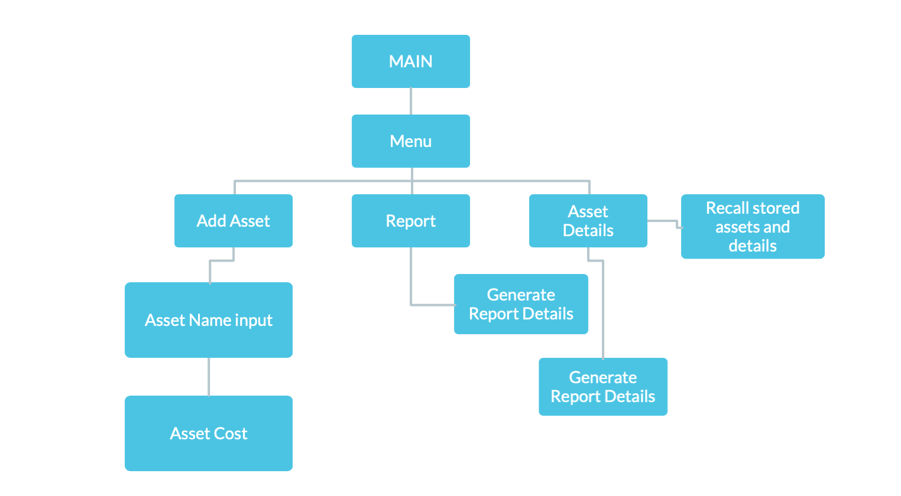
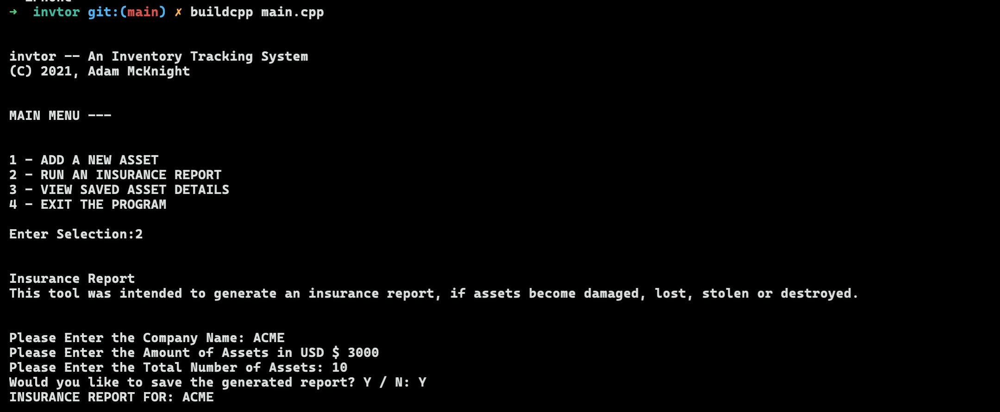

# invtor
An inventory tracking system - built in C++

# Asset Tracking System
**Final for CIS1111** 

## What is this project?
An Inventory and Asset Tracking system with insurance reporting tools.

&nbsp;
# Flowchart & I/O:
Note, image rendering within the readme may not work. If the flowchart image is not shown below...
Then you can access the flowchart by; navigating to the root of the project directory and clicking the "flowchart.png" file.

&nbsp;
## Project Input and Output:

**The project should output the following...** &nbsp;

invtor -- An Inventory Tracking System
(C) 2021, Adam McKnight

MAIN MENU --

1 - ADD A NEW ASSET
2 - RUN AN INSURANCE REPORT
3 - VIEW SAVED ASSET DETAILS
4 - EXIT THE PROGRAM

Enter Selection: ...

&nbsp;
$ END 

&nbsp;
# Installation and Usage:
## Project Installation instructions
To start the project, first you must have a C++ compiler installed on your system.
After a C++ compiler is installed on your system, navigate to the project directory.

Once in the project directory,

**Windows Users Run:**
  `~ gcc main.cpp -o a.exe`&nbsp;to compile the source-code.
&nbsp;
After the source code is compiled, run the .exe file by typing `a.exe` and hitting the enter key. The program should run. If there is an issue with the output or program, please open an "Issue" within the Github repo so it can be corrected or looked into.

**Linux or MacOS Users Run:**
  `~ gcc main.cpp -o a.out`&nbsp; to compile the source-code.&nbsp;
After the source code is compiled, run the .out file by typing `a.out` and hitting the enter key. The program should run. If there is an issue with the output or program, please open an "Issue" within the Github repo so it can be corrected or looked into.

&nbsp;
## Project Usage:
There are 5 options to select in the program. Many of the programs features are still being built. The only feature that are available at this time is the **Billing Calculator** or option number 5. Once at the main screen. Enter the number **5** on your keyboard. The program should then ask a series of questions, and calculate the total cost of a patients bill based on the input provided.

&nbsp;
# Copyright Notice
Copyright 2021, Adam McKnight - All Rights Reserved. 
 See LICENCE for more details on usage.

